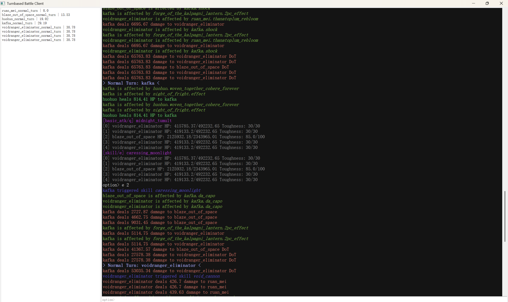

# Turnbased：一款回合制战斗模拟器

[English](README.md)


一款用 Python 编写的高保真回合制战斗模拟引擎。

> 灵感来源于《崩坏：星穹铁道》的复杂战斗机制。

## 工作原理

- **事件总线**：所有游戏内事件（`hit`、`heal`、`weakness_break` 等）均由事件总线分发，实现了关注点的清晰分离。

- **修饰器系统**：每个属性（`ATK`、`SPD` 等）都是一个 `Stat` 对象，其中包含一个 `Modifier` 列表。`Modifier` 可以附带动态校验器（例如，仅在“完全燃烧”状态下生效）。

- **伤害管道**：伤害计算被分解为若干独立因子（`DMG_BOOST`、`DEFENCE`、`RESISTANCE` 等），每个因子都有自己的基准函数和修饰逻辑。

## 快速开始



### 环境要求

- Python 3.11 或更高版本
- `pip`（或 `pipenv`）

### 安装

克隆仓库并安装依赖：

```bash
git clone https://github.com/Cosmiclnd/Turnbased.git
cd Turnbased
pip install -r requirements.txt
```

### 运行模拟器

1. **启动服务器**（在一个终端中）：

```bash
python core/main.py
```

该命令会启动一个 WebSocket 服务器，地址为 `ws://127.0.0.1:55716`。

2. **启动客户端**（在另一个终端中）：

```bash
python client/main.py
```

客户端会自动连接，加载默认的战斗配置，之后您就可以开始交互了。

> 目前您需要手动编辑 `client/userdata/config.json` 来创建自己的战斗。未来会提供一个图形界面用于编辑战斗配置。

## 项目结构

```text
client/         # PyQt5 前端
config/         # 所有静态游戏数据（JSON 格式）
core/           # 后端服务器
docs/           # 文档（正在编写中）
mirror_test/    # 预录测试场景（手动构建）
utilities/      # 工具脚本
```

## 许可证

本项目采用 MIT 许可证进行开源。您可以自由使用、修改和分发代码，无论是非商业还是商业用途，但必须保留原始版权声明。

## 免责声明

- 所有游戏数据、角色名称、技能名称及其相关设定均为 COGNOSPHERE PTE. LTD.（HoYoverse）的知识产权。
- 本项目与 HoYoverse 无任何关联，未经其认可或赞助。
- 本仓库中的数值和机制要么来自公开渠道，要么通过游戏内观察估算，要么为测试目的而创建。它们不能保证是官方游戏的精确再现。
- 本软件“按原样”提供，仅用于教育和研究目的。请勿将其用于任何商业活动。

## 参与贡献

尽管这是一个个人项目，但我们欢迎提交 Issue 和 Pull Request！请确保您的代码遵循现有的事件驱动模式。
